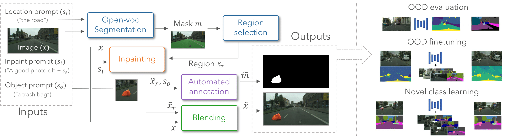

# Placing Objects in Context via Inpainting for Out-of-distribution Segmentation

[](https://www.python.org/)
[](https://pytorch.org)

Codebase to realistically insert objects into images via diffusion inpainting models with applications to anomaly segmentation and dataset extension as presented in *Placing Objects in Context via Inpainting for Out-of-distribution Segmentation*.



---

## Dependencies
This repository is built on top of different repositories for the generative pipeline and the anomaly segmentation analyses. Thus we recommend using different conda environments to install the necessary dependencies more easily.

### POC pipeline
Our implementation of the Placing Objects in Context (POC) pipeline depends on two main blocks. An open vocabulary segmentor [`GSAM`](https://github.com/IDEA-Research/Grounded-Segment-Anything#running_man-grounded-sam-detect-and-segment-everything-with-text-prompt) and an inpainting [`model`](https://huggingface.co/stabilityai/stable-diffusion-2-inpainting) based on StableDiffusion. based on StableDiffusion.

In order to run our pipeline, from the repo you may create a conda environment with the following commands:

```bash
# From within the cloned repo main folder
git clone https://github.com/naver/poc.git
cd poc/Grounded-Segment-Anything

export CUDA_HOME=/PATH/TO/CUDA_11.6
conda create -n POC python=3.10 -y
conda activate POC
pip install torch==1.13.1+cu116 torchvision==0.14.1+cu116 torchaudio==0.13.1 --extra-index-url https://download.pytorch.org/whl/cu116
python -m pip install -e segment_anything
python -m pip install -e GroundingDINO
pip install diffusers[torch]==0.15.1
```

You also need to download the checkpoints for GSAM:
```bash
cd /MODEL/CHECKPOINT/FOLDER
wget https://dl.fbaipublicfiles.com/segment_anything/sam_vit_h_4b8939.pth
wget https://github.com/IDEA-Research/GroundingDINO/releases/download/v0.1.0-alpha/groundingdino_swint_ogc.pth
```
Then modify the corresponding paths in [path_utils.py](poc/path_utils.py)


### Anomaly segmentation
To fine-tunine models with OOD data and perform anomaly segmentation please install the dependencies from `RPL`, `Mask2Anomaly` and `RbA` as detailed in their resepective documentation. Note that `Mask2Anomaly` and `RbA` can share the same environment given they are both built on top of [`Mask2Former`](https://github.com/facebookresearch/Mask2Former).

### Dataset extension
To train models with extended datasets we use the `relis` repository. Please install their dependencies to run `mmsegmentation` models.

---

## Datasets

### Existing benchmarks
To evaluate anomaly segmentation we take the evaluation sets provided in [`Mask2Anomaly`](https://github.com/shyam671/Mask2Anomaly-Unmasking-Anomalies-in-Road-Scene-Segmentation/tree/main) via this [`link`](https://drive.google.com/file/d/1r2eFANvSlcUjxcerjC8l6dRa0slowMpx/view?usp=share_link). 

To fine-tune with Cityscapes and COCO, please download and prepare the datasets as described in [`Mask2Anomaly`](https://github.com/shyam671/Mask2Anomaly-Unmasking-Anomalies-in-Road-Scene-Segmentation/tree/main) (all anomaly segmentation methods follow the same pre-processing).

For dataset extension, please download the [`PASCAL`](http://host.robots.ox.ac.uk/pascal/VOC/voc2012/index.html#devkit) dataset (VOC2012) for evaluation.

### POC Datasets
You can download the datasets generated in our work with the following link
``` bash
wget https://download.europe.naverlabs.com/POC_Datasets/data.zip
unzip data.zip
```
The zip file does not contain the full images but only the local changes applied when inpainting an object. To obtain the final images you need to download the base datasets: [Cityscapes](https://www.cityscapes-dataset.com) or [ACDC](https://acdc.vision.ee.ethz.ch/login?target=%2Fdownload). Then you may run the `poc/prepare_datasets.py` script. To run it, first you need modify the root folder with the unzipped POC files and relevant base datasets. The POC datasets are released under the following [license](LICENSE_POC_Inpaintings.txt).

---

## Getting started with POC

Download the SAM and GroundingDINO checkpoints for GSAM as well as the inpainting model:

``` bash
cd /PATH/TO/MODELS/
# SAM weights
wget https://dl.fbaipublicfiles.com/segment_anything/sam_vit_h_4b8939.pth
# GroundingDino
wget https://github.com/IDEA-Research/GroundingDINO/releases/download/v0.1.0-alpha/groundingdino_swint_ogc.pth

## Inpainting model
# Make sure you have git-lfs installed (https://git-lfs.com)
git lfs install
git clone https://huggingface.co/stabilityai/stable-diffusion-2-inpainting
```

Fill the corresponding paths in `poc/path_utils.py` and run the `poc/poc_pipeline_demo.ipynb`.


---

## Generating POC datasets

You may download [Cityscapes](https://www.cityscapes-dataset.com), [IDD](https://idd.insaan.iiit.ac.in/) and [ACDC](https://acdc.vision.ee.ethz.ch/login?target=%2Fdownload) or you may use your own dataset. 

To generate the datasets you may call the `poc/generate_poc_dset.py`. You may refer to the `poc/launch_*.py` scripts for usage examples to generate datasets with the same settings as used in our work.

You may also generate datasets with the Text2Image baselines using `poc/generate_t2i_dset.py`. In that case please download the stable diffusion base model 
```bash
## Base text2image model
# Make sure you have git-lfs installed (https://git-lfs.com)
git lfs install
git clone https://huggingface.co/stabilityai/stable-diffusion-2-base
```
and add the path to `poc/path_utils.py`.

---

## Fine-tuning and evaluating anomaly segmentation

### Mask2Anomaly
Check the config files in `Mask2Anomaly/configs/cityscapes/semantic-segmentation/` and replace the paths as appropriate. Then check the `Mask2Anomaly/run.sh` for the commands to fine-tune and evaluate models.

### RPL
Modify the paths to datasets in `RPL/rpl_corocl.code/config/config.py`. Then check `RPL/launch_fine-tune.sh` and `RPL/launch_test.sh`

### RbA
Check the config files of models in `RbA/ckpts/` and commands to fine-tune and evaluate in `RbA/launch_model_ft.sh` and `RPL/launch_test.sh` respectively.


---

## Learning new classes from POC data
To train models follow `relis/mmsegmentation` instructions. Once models are trained, fill the dataset paths, model checkpoints and configs in `relis/path_dicts.py`. In `relis/launch_helpers.py` you can find helper scripts to generate launch commands to evaluate models.

---

## Reference

**Placing Objects in Context via Inpainting for Out-of-distribution Segmentation** (to appear at ECCV 2024)  
Pau de Jorge, Riccardo Volpi, Puneet K. Dokania, Philip H. S. Torr and Grégory Rogez
```
    @InProceedings{deJorge_2024_ECCV,
    author = {de Jorge, Pau and Volpi, Riccardo and Dakania, Puneet K. and Torr, Philip H. S. and Gregory, Rogez},
    title = {Placing Objects in Context via Inpainting for Out-of-distribution Segmentation},
    booktitle = {The European Conference on Computer Vision (ECCV)},
    month = {October},
    year = {2024}
    }
```


